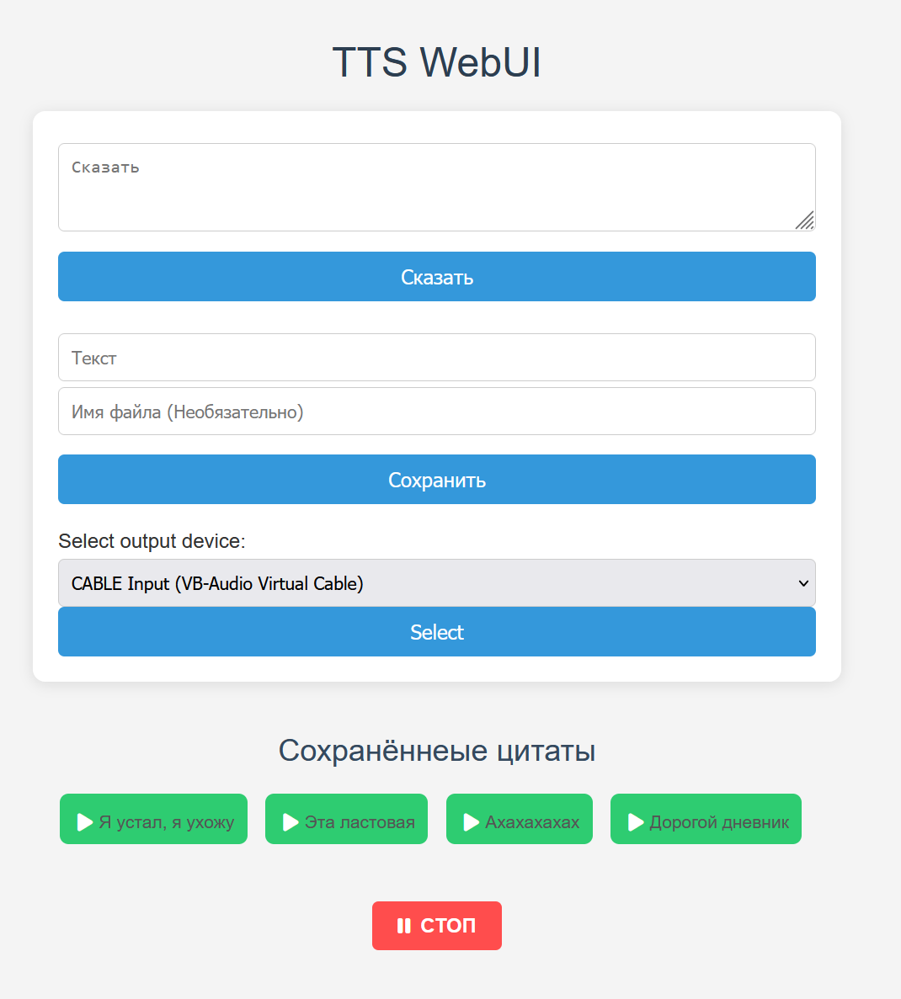

<div align="center">

#  TTS WebUI

## Simple TTS WebUI



</div>

## Installing

1. Install any virtual audio cable
    - for example [VB Audio Cable](https://vb-audio.com/Cable/)
2. Install Python (3.10.x is recommended)
3. Clone repo
    ```pwsh
    git clone https://github.com/wiered/tts-voice.git
    cd tts-webui
    ```
4. Create and activate venv
    ```pwsh
    py -m venv .venv
    .\.venv\Scripts\activate.ps1
    ```
5. Install requirements
    ```pwsh
    pip install -r requirements.txt
    ```
6. Run
    ```pwsh
    py ./src/main.py
    ```

## Credits

<a href="https://www.flaticon.com/free-icons/radio" title="radio icons">Radio icons created by Freepik - Flaticon</a>